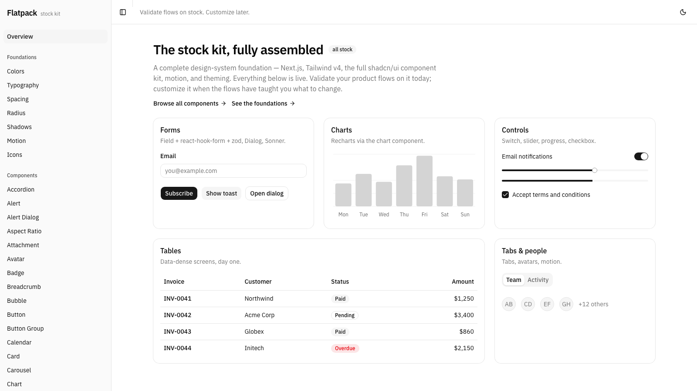

# Flatpack

**A Claude Code skill that scaffolds a complete, product-ready design-system foundation in minutes — full component kit, forms, charts, theming, and motion, all stock, all verified working.**

Like the name says: everything arrives in one box, assembles itself, and you customize it *after* it's standing.

<picture>
  <source media="(prefers-color-scheme: dark)" srcset="assets/flatpack-dark.png">
  
</picture>

*This screenshot is an actual, unmodified scaffold output — the kitchen-sink playground page the skill generates and verifies. Light and dark ship working out of the box.*

**[Live demo →](https://flatpack-demo.vercel.app)** — the same untouched scaffold output, deployed as-is.

## Why

Product teams lose weeks at the start of a project wiring up the same foundation — and then lose more time validating UX on a half-stocked starter where every missing component stalls a flow. Flatpack inverts that: you get the **entire** stock kit on day one, build and validate your real user flows immediately, and only then invest in customizing tokens and components — as deliberate decisions informed by what the flows revealed.

Stock is the point. The default kit is coherent, accessible, and theme-ready, so nothing blocks flow-building and nothing you'd later undo gets baked in.

## What you get

Run the skill in an empty directory, and a few minutes later:

| Layer | What ships |
|---|---|
| Framework | **Next.js** (App Router) + TypeScript + ESLint |
| Styling | **Tailwind v4** (CSS-first config) |
| Components | The **full shadcn/ui kit** (~60 components: tables, charts, sidebar, calendar, dialogs, command menu, …) built on **Base UI** primitives — copied in as source you own |
| Forms | **react-hook-form + zod**, working with validation day one |
| Motion | **motion** (motion.dev) |
| Theming | **next-themes** — light/dark wired into the layout with a working toggle |
| Proof | A kitchen-sink playground page, `typecheck` + production build verified green before handoff |

Everything at latest majors, everything stock defaults, plus an initial git commit.

The skill also encodes the drift gotchas that break naive setups right now: the registry's Radix→Base UI shift, the zod v4 resolver typing conflict, pnpm v11's blocked postinstall scripts, and shadcn's circular `--font-sans` mapping that silently renders your app in serif.

## Install

Clone this repo into your Claude Code skills directory:

```bash
git clone https://github.com/doughawk25/flatpack.git ~/.claude/skills/flatpack
```

That's it — Claude Code picks it up automatically.

## Use

In any Claude Code session:

```
/flatpack
```

…or just say what you want: *"spin up a new system called acme-app in ~/projects"*. Claude scaffolds, wires, verifies (typecheck + build + a running dev server), and hands you the report. Ask for a shareable link and — if your Vercel CLI is logged in — it deploys and hands you a public URL for stakeholders too.

Two shapes are supported:

- **Single app** (default) — one Next.js app, fastest path to building screens.
- **Monorepo** — pnpm workspaces + Turborepo (`apps/site` + `packages/ui|tokens|config`) for teams that plan to publish or share the system across apps. Ask for "the monorepo shape."

## Requirements

- [Claude Code](https://claude.com/claude-code)
- Node.js 18+

pnpm is optional — the skill falls back to `npx pnpm` on machines without it.

## The workflow it's built for

1. **Flatpack** a fresh project (minutes).
2. **Build your real user flows** on the stock kit — signup, checkout, dashboards, settings — with zero component gaps.
3. **Validate the UX** with users and stakeholders while the design is neutral and nobody's attached to pixels.
4. **Then customize** — tokens first (colors, radii, fonts in `globals.css`), component source second. You own all of it; there's no library to fork or fight.

## Status

- ✅ React / Next.js — execution-tested end to end (scaffold → typecheck → production build → visual check)
- 🔜 Vue (Nuxt + shadcn-vue) and Svelte (SvelteKit + shadcn-svelte) variants

---

Built by [@doughawk25](https://github.com/doughawk25). The web ecosystem moves fast — if a scaffold step breaks against a newer registry, open an issue.
